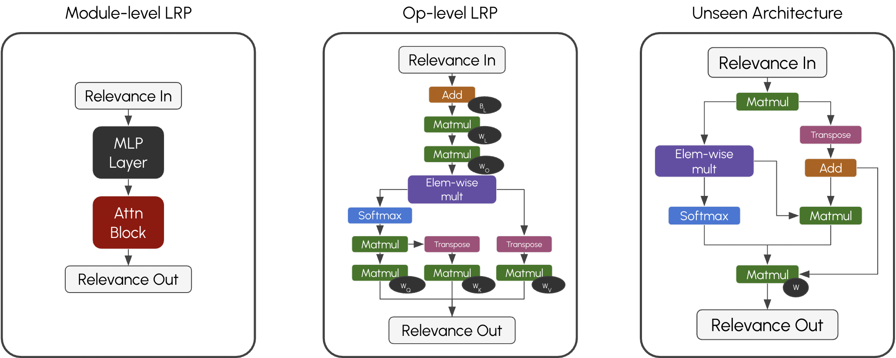

# Dynamic Layerwise Relevance Propagation
## By Kevin Lee and Dr. Pablo M. Arias
## June - December 2025
## [Paper (submission pending)](https://arxiv.org/submit/7057400/view)



A framework based on <a href="#ref1">Bach et al.'s 2015 LRP method</a>, incorporating work done by <a href="#ref2">Achtibat et al. (2024) in extending LRP to Transformers</a>, and applied to methodologies inspired by <a href="#ref3">Michel et al.</a> and <a href="#ref4">Voita et al.</a>'s work in analyzing disproportionate importance across heads in multi-head attention.

Improves upon theoretical and currently implemented LRP methods (<a href="#ref5">Zennit</a> being the latest) by decomposing LRP's defined rules to a per-operation level to enable model-agnostic capability. This is similar to how libraries like <a href="#ref6">PyTorch's autograd</a> generalized the <a href="#ref7">gradient backpropagation method</a> to any model architecture programmable in their framework. We thus provide a central platform for the implementation of new rules based on individual tensor operations created for emerging machine learning architectures.

We also referred to a past <a href="#ref8">LRP implementation by Fischer, K.</a> for including the idea of the relevance filter and some testing/visualization code on VGG image examples.

Our attributions obtain equal or greater Area Between Perturbation Curves in pixel flipping evaluations than specialized implementations on visual tasks with ViT-b-16 and VGG16, and demonstrate high top-1 attribution-to-prediction accuracy in SQuADv2 Question-Answering tasks with RoBERTa-large (98%) and Flan-T5-large (97%).

<table>
  <tr>
    <td width="32%">Original Image</td>
     <td width="32%">Zennit LRP</td>
     <td width="32%">DynamicLRP</td>
  </tr>
  <tr>
    <td></td>
    <td></td>
    <td></td>
  </tr>
 </table>

# Usage
Clone this repository and make use of the `LRPEngine` class from the `lrp` Python module.
An instance of LRPEngine has the following initialization parameters:
- `params_to_interpret`: A list of Tensors, which reference Tensors we wish to attribute relevance for, such as model inputs and parameters.
    - Embedding layers are by default marked for saving relevance, so in the case of model inputs, this parameter is mainly for models which do not embed their inputs.
- `use_gamma`: A boolean indicating whether Linear and Convolution layers should use the Gamma-LRP rule, which causes contributions to be amplified in the direction of their signs by considering only the components c_ijk = x_ij * w_jk of the linear combination that make up some contribution z_ik where sign(z_ik) = sign(c_ijk). Increases computation and memory requirements.
- `use_z_plus`: A boolean indicating whether Linear and Convolution layers should use the Z<sup>+</sup>-LRP rule, which clamps all contributions to only be positive.
- `relevance_filter`: A float value `k` from 0.0 to 1.0 (inclusive) which restricts relevance passing through Linear and Convolution layers only to the top `k * 100`-percent relevance values. Filters out noise and less important features. Defaults to 1.0 (all relevance).

Use the LRP Engine as such:
```
# Load your model and data
model = ...
x = ...

# Run your model on some input
output = model(x)

# Extract logits or hidden states (if output is a custom output class instance)
logits = output.logits

# Instantiate LRPEngine
from lrp_engine import LRPEngine
lrp = LRPEngine()

# Run LRPEngine
checkpoint_rels, param_rels = lrp.run(logits)

# Visualize relevance according to your use case, see .ipynb files for examples
...
```

# References
<ol>
    <li id="ref1">Bach S, Binder A, Montavon G, Klauschen F, Müller KR. (2015) On Pixel-Wise Explanations for Non-Linear Classifier Decisions by Layer-Wise Relevance Propagation. PLOS ONE 10(7): e0130140. URL: https://doi.org/10.1371/journal.pone.0130140.</li>
    <li id="ref2">Achtibat R, Hatefi SMV, Dreyer M, Jain A, Wiegand T, Lapuschkin S, Samek W. (2024) AttnLRP: Attention-Aware Layer-Wise Relevance Propagation for Transformers. URL: https://doi.org/10.48550/arXiv.2402.05602</li>
    <li id="ref3">Michel P, Levy O, Neubig G. (2019) Are Sixteen Heads Really Better Than One? URL: 
    https://doi.org/10.48550/arXiv.1905.10650</li>
    <li id="ref4">Voita E, Talbot D, Moiseev F, Sennrich R, Titov I. (2019) Analyzing Multi-Head Self-Attention: Specialized Heads Do the Heavy Lifting, the Rest Can Be Pruned. URL: https://doi.org/10.48550/arXiv.1905.09418</li>
    <li id="ref5">Anders CJ, Neumann D, Samek W, Müller KR, Lapuschkin S. (2023) Software for Dataset-wide XAI: From Local Explanations to Global Insights with Zennit, CoRelAy, and ViRelAy. URL: https://arxiv.org/abs/2106.13200
    <li id="ref6">Paszke A, Gross S, Chintala S, Chanan G, Yang E, DeVito Z, Lin Z, Desmaison A, Antiga L, Lerer A. (2017) Automatic differentiation in PyTorch. URL: https://openreview.net/pdf?id=BJJsrmfCZ</li>
    <li id="ref7">Rumelhart DE, Hinton GE, Williams RJ. (1986) Learning representations by back-propagating errors. Nature 323(9) pp. 533-536. URL: https://doi.org/10.1038/323533a0</li>
    <li id="ref8">Fischer K. (2021) Relevance Propagation with PyTorch. URL: https://kaifishr.github.io/2021/12/15/relevance-propagation-pytorch.html</li>
</ol>
